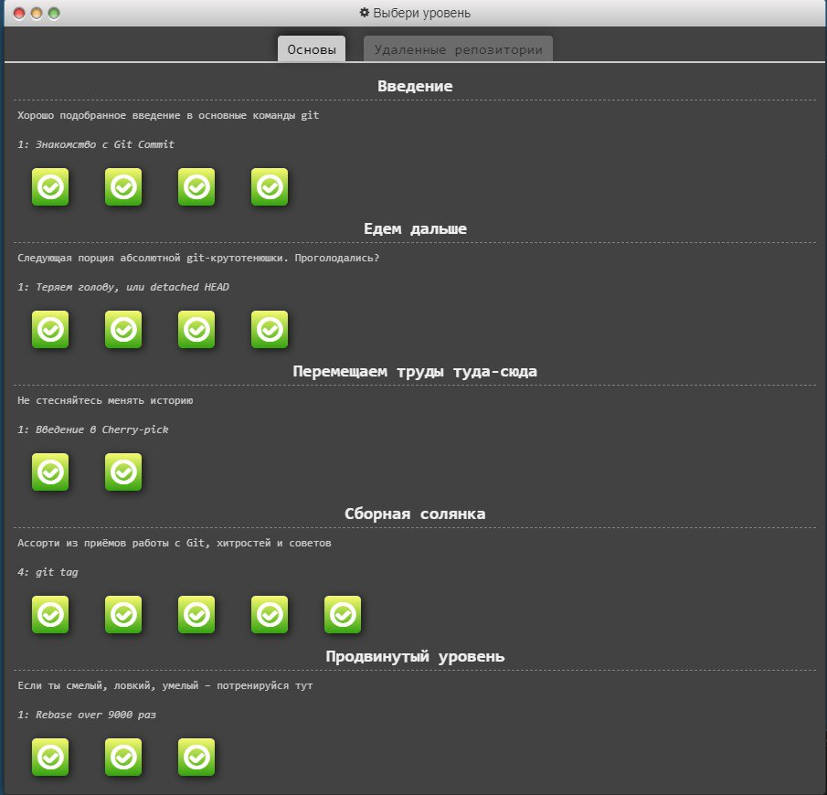
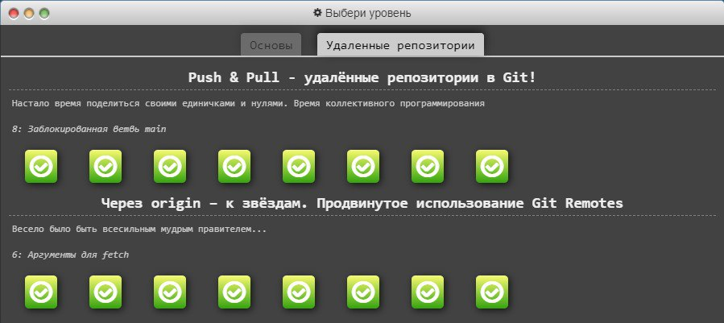
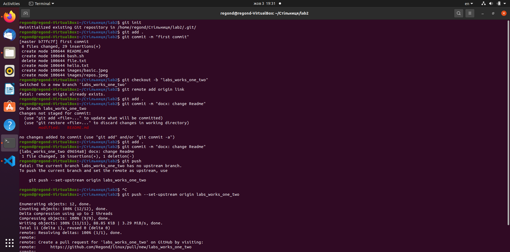

# Лабораторна робота 2 з предмету Операційні системи
## **Основні команди системи контролю версій Git.**

Виконав студент 1-го курсу\
групи ІПЗ2.2\
Ткач Василь Віталійович


## Пройдені рівні з основами


## Пройдені рівні по роботі з репозиторіями


## Створюю локальний репозиторій та файл README.md
```
    git init
    echo "readme" >> README.md
```
## Створю комміт та передаю файли в staging area
```
    git add .
    git commit -m "first commit"
```

## Створю та перейду до нової вітки lab_works_one_two
```
    git checkout -b "lab_works_one_two"
```

## Підключаю віддалений репозиторій
```
    git remote add origin link
```
## Відсилаю файли у віддалений репозиторій
```
    git push
```
## Скрін з консолі з підтвердженням введених команд


